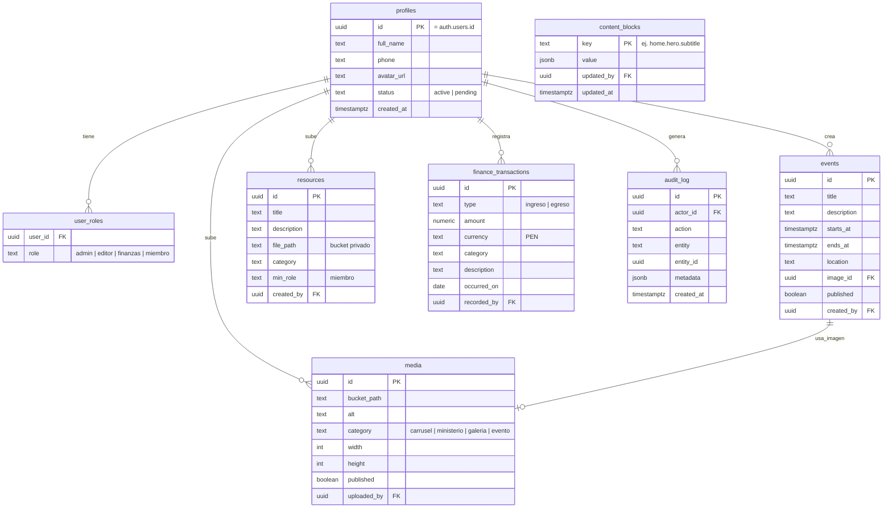

# Diseño del Portal — Iglesia Nueva Casa

> Documento de arquitectura del portal (panel administrativo + área de miembros).
> Estado: **borrador para revisión**. Es la fuente de verdad del diseño; se
> actualiza a medida que decidimos. No es código todavía.

---

## 1. Objetivo

Construir un **portal con roles** sobre el sitio actual (React + Vite + Supabase),
que permita:

- Gestionar **fotos** que se van agregando (galería del sitio).
- Editar un **conjunto curado de textos** del sitio.
- Gestionar **eventos** (se publican en el sitio público).
- **CRUD de usuarios** con roles y permisos.
- Un módulo de **finanzas** (sensible, aislado).
- Que **miembros** de la congregación inicien sesión para **descargar material**.

## 2. Las tres zonas

| Zona | Ruta | Quién entra | Para qué |
|------|------|-------------|----------|
| **Sitio público** | `/` (actual) | Cualquiera (anónimo) | Ver contenido publicado (textos, eventos, fotos) |
| **Área de miembros** | `/portal/*` | Miembros con sesión | Descargar material, ver anuncios/eventos |
| **Panel admin** | `/admin/*` | Staff (según rol) | Gestionar todo el contenido y datos |

Login compartido en `/login`; tras autenticarse, se redirige según el rol
(un miembro va a `/portal`, un admin/editor/finanzas va a `/admin`).

## 3. Roles y permisos (RBAC)

Cuatro roles. Un usuario puede tener **más de uno** (ej. un pastor puede ser
`admin` + `finanzas`), por eso usamos una tabla `user_roles` (no un solo campo).

| Rol | Puede |
|-----|-------|
| **Administrador** | Todo: usuarios, roles, contenido, eventos, fotos, finanzas, descargas. |
| **Editor** | Textos editables, eventos y fotos. **No** ve usuarios ni finanzas. |
| **Finanzas / Tesorero** | Solo el módulo de finanzas (aislado). |
| **Miembro** | Solo el área de miembros: descargar material, ver eventos. |

**Matriz de acceso (resumen):**

| Módulo | Admin | Editor | Finanzas | Miembro |
|--------|:-----:|:------:|:--------:|:-------:|
| Usuarios / roles | ✅ | — | — | — |
| Textos editables | ✅ | ✅ | — | — |
| Eventos | ✅ | ✅ | — | ver |
| Fotos / galería | ✅ | ✅ | — | ver |
| Finanzas | ✅ | — | ✅ | — |
| Descargas (material) | ✅ | subir | — | descargar |
| Mensajes de contacto | ✅ | — | — | — |

> **Principio de seguridad:** los permisos se aplican en la **base de datos con
> RLS de Postgres**, no ocultando botones en la UI. Aunque alguien vea el código
> del portal, sin el rol correcto la base de datos rechaza la operación.

## 4. Autenticación

- **Supabase Auth** (email + contraseña; opcional: enlace mágico o Google más adelante).
- **Cuentas de staff** (admin/editor/finanzas): las crea/invita un Administrador.
  No hay registro público para staff.
- **Cuentas de miembros:** hay dos opciones (⇒ **decisión abierta**, ver §11):
  1. **Registro abierto con aprobación**: cualquiera se registra y queda
     `pending`; un admin lo aprueba y le da rol `miembro`.
  2. **Solo por invitación**: el admin invita por correo.
  Recomendación inicial: **registro con aprobación** (la iglesia controla quién
  es miembro, pero sin trabajo manual de crear cada cuenta).
- **Roles en el token (JWT):** usar un *custom access token hook* de Supabase para
  incrustar los roles en el JWT → RLS más eficiente. Alternativa pragmática:
  una función `has_role(uid, rol)` `security definer` usada dentro de las políticas.

## 5. Modelo de datos

Tablas nuevas (además de `contact_submissions` que ya existe):



Notas:
- `profiles.id` es el mismo `id` de `auth.users` (1‑a‑1 con Supabase Auth).
- `content_blocks` es clave→valor (JSON) para los textos curados editables.
- `audit_log` registra acciones sensibles (finanzas, cambios de usuarios/roles).

## 6. Almacenamiento (Supabase Storage)

| Bucket | Acceso | Uso |
|--------|--------|-----|
| `public-images` | Lectura pública | Fotos del sitio, imágenes de eventos |
| `member-resources` | **Privado** | Material descargable (URLs firmadas, solo miembros) |
| `finance-docs` | **Privado** | Adjuntos de finanzas (solo rol finanzas) |

- Las imágenes se **optimizan al subir** (mantener el rendimiento que ganamos).
- Las descargas usan **URLs firmadas temporales**, generadas solo si el usuario
  tiene el rol; nunca se expone el archivo directamente.

## 7. Políticas RLS (resumen por tabla)

| Tabla | SELECT | INSERT / UPDATE / DELETE |
|-------|--------|--------------------------|
| `profiles` | propio + admin | propio (datos básicos) + admin |
| `user_roles` | propio (leer sus roles) | solo admin |
| `content_blocks` | público (todos) | editor + admin |
| `events` | público si `published`; staff todo | editor + admin |
| `media` | público si `published` | editor + admin |
| `resources` (metadatos) | miembro + staff | editor + admin (archivo por URL firmada) |
| `finance_transactions` | finanzas + admin | finanzas + admin |
| `audit_log` | admin | escrito por triggers/funciones |
| `contact_submissions` | **admin** (nuevo) | anon INSERT (ya existe) |

## 8. Integración con el sitio público (el gran trade-off)

Hoy el sitio es **estático e instantáneo**. Al volver editables los textos
curados, los eventos y las fotos, esas partes pasan a leerse desde Supabase.

**Cómo lo mantenemos rápido:**
- El sitio lee solo las filas **publicadas** con la anon key (RLS: público lee
  `published = true`).
- Una **función serverless con caché** (`/api/content`, `/api/eventos`) al estilo
  de la que ya usamos para prédicas → respuestas rápidas y frescas sin rebuild.
- Solo las secciones dinámicas muestran estado de carga; el resto del sitio
  sigue instantáneo.
- Lo que **no** cambia seguido puede quedarse en código; solo movemos a la base
  lo que el equipo realmente edita.

Esto es el principal cambio arquitectónico: el sitio público gana una **capa de
datos** para las partes editables.

## 9. Rutas y protección

```
/                     → sitio público (actual)
/login                → login compartido
/portal               → área de miembros (rol: miembro | staff)
/portal/material      → descargas
/admin                → dashboard (rol: admin | editor | finanzas)
/admin/usuarios       → CRUD usuarios (admin)
/admin/contenido      → textos editables (editor, admin)
/admin/eventos        → eventos (editor, admin)
/admin/fotos          → galería (editor, admin)
/admin/mensajes       → mensajes de contacto (admin)
/admin/finanzas       → finanzas (finanzas, admin)
```

- `<AuthGuard>` — redirige a `/login` si no hay sesión.
- `<RoleGuard rol="...">` — bloquea por rol cada sección.
- Las rutas del portal se cargan **lazy** → el visitante público no descarga ese código.

## 10. Stack técnico (añadidos)

| Necesidad | Herramienta |
|-----------|-------------|
| Auth + datos | Supabase Auth + `@supabase/supabase-js` (ya está) |
| Fetch/caché en el admin | TanStack Query (React Query) |
| Formularios + validación | react-hook-form + zod |
| UI (tablas, diálogos) | shadcn/ui (ya está) + componentes nuevos |
| Textos editables | Markdown / texto plano al inicio (editor enriquecido después) |
| Operaciones con privilegios | Funciones serverless con **service-role key** (crear usuarios, invitaciones, URLs firmadas) — nunca en el cliente |
| Correos (invitaciones/avisos) | Resend vía serverless (a definir) |

## 11. Seguridad — puntos críticos

- **RLS es la capa de defensa** (no la UI).
- **Finanzas aislado**: solo rol finanzas/admin, con **log de auditoría** de cada
  movimiento.
- **Buckets privados + URLs firmadas** para descargas.
- La **service-role key** solo vive en funciones serverless (Vercel), nunca en el
  bundle del cliente.
- **Anti-spam** en el registro de miembros (honeypot/captcha) para evitar cuentas basura.

## 12. Roadmap por fases

Cada fase queda funcional antes de pasar a la siguiente.

| Fase | Entrega |
|------|---------|
| **0 — Base** | Auth + `profiles` + `user_roles` + RLS/helpers + `/login` + shell `/admin` con guards. Primer valor: **admin ve los mensajes de contacto**. |
| **1 — Usuarios** | CRUD de usuarios + asignación de roles + flujo de aprobación de miembros. |
| **2 — Fotos** | Gestión de imágenes (subida optimizada) → galería en el sitio. |
| **3 — Eventos** | Gestión de eventos → sección de eventos en el sitio. |
| **4 — Textos** | Set curado de textos editables → el sitio los lee. |
| **5 — Miembros** | Área de miembros + descargas (bucket privado). |
| **6 — Finanzas** | Módulo de finanzas con roles estrictos + auditoría. |

## 13. Decisiones abiertas (a cerrar)

1. **Registro de miembros:** ¿abierto con aprobación, o solo por invitación?
2. **Textos editables:** ¿qué textos exactos? (hay que listar los campos: horarios,
   anuncios, descripciones de ministerios, hero, etc.)
3. **Finanzas:** ¿registro completo de ingresos/egresos, o solo ver resúmenes/reportes?
4. **Correos:** ¿integramos envío de correos (invitaciones, avisos)? ¿con qué proveedor?
5. **Eventos:** ¿inscripción/RSVP de miembros, o solo informativo?
6. **Directorio de miembros:** ¿los miembros tienen perfil visible entre ellos, o
   solo acceso a descargas?

---

## Próximo paso propuesto
Revisar y ajustar este documento. Cuando esté aprobado, arrancamos por la **Fase 0**
(la base de auth + roles), que es el cimiento de todo lo demás.
